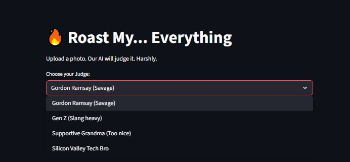
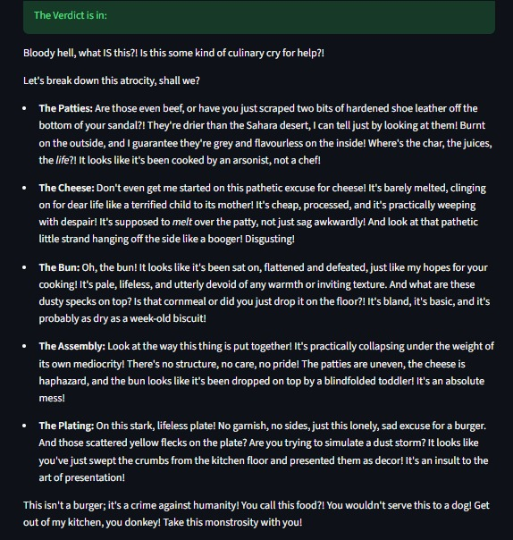

# 🔥 JudgeMyVibe: The Brutal AI Critic


> **Built for Hacklahoma 2026**
>
> *An AI that doesn't just see your photo, but feels the vibe and roasts it.*

[](https://streamlit.io)
[](https://ai.google.dev/)
[](https://www.python.org/)

## 📸 Overview
**JudgeMyVibe** is a multimodal AI application that uses computer vision to analyze your photos and generate context-aware "roasts." Whether it's your messy code, your sad lunch, or your questionable fashion choices, our AI personalities (like *Gordon Ramsay* or a *Silicon Valley Tech Bro*) will tell you exactly what they think.

Powered by **Google's Gemini 2.5 Flash** model for sub-second visual analysis.
## 📸 Screenshots

| **The Judge Select** | **The Roast (Gordon Ramsay Mode)** |
|:-----------------:|:--------------------------------:|
|  |  |

### How it Works
1. **Upload:** Drag & drop any image (code, food, selfie).
2. **Analyze:** Gemini 2.5 Vision scans the image for details.
3. **Roast:** The AI generates a personality-based critique.


## ✨ Features
* **Multimodal Analysis:** Uses Gemini 2.5 Vision to identify specific details in images (e.g., "untied shoelaces," "spaghetti code," "dry burger").
* **Distinct Personas:** Switch between different "Judges":
    * 🍳 **Gordon Ramsay:** Brutal, culinary-focused insults.
    * 💻 **Tech Bro:** Condescending optimization advice.
    * 👵 **Supportive Grandma:** Finds the good in everything (too nice).
    * 💀 **Gen Z:** Uses slang to destroy your confidence.
* **Instant Feedback:** Built on Streamlit for real-time interaction.

## 🚀 Demo
*(Insert a link to your demo video or deployed app here once available)*


*(Note: Upload the screenshot of the burger roast to your repo and link it here)*

## 🛠️ Tech Stack
* **Frontend:** [Streamlit](https://streamlit.io/)
* **AI Model:** [Google Gemini 2.5 Flash](https://ai.google.dev/) (via `google-generativeai` SDK)
* **Language:** Python 3.12

## 📦 Installation & Setup

1.  **Clone the repository**
    ```bash
    git clone [https://github.com/YOUR_USERNAME/JudgeMyVibe.git](https://github.com/YOUR_USERNAME/JudgeMyVibe.git)
    cd JudgeMyVibe
    ```

2.  **Install dependencies**
    ```bash
    pip install -r requirements.txt
    ```

3.  **Set up your API Key**
    * Get a key from [Google AI Studio](https://aistudio.google.com/).
    * Create a `.env` file or export it in your terminal:
    ```bash
    export GOOGLE_API_KEY="your_api_key_here"
    ```
    *(Or paste it directly into `app.py` for testing, but don't commit it!)*

4.  **Run the App**
    ```bash
    streamlit run app.py
    ```

## 💡 How We Built It
We built this in under 10 hours during **Hacklahoma 2026**.
The core challenge was prompt engineering the Gemini model to be "mean" without triggering safety filters. We utilized **System Instructions** to define the personas and the `gemini-2.5-flash` model to ensure the vision processing was fast enough for a live demo.

## 📄 License
This project is licensed under the MIT License - see the [LICENSE](LICENSE) file for details.

---
*Made with ☕ and 🌶️ at Hacklahoma 2026.*
